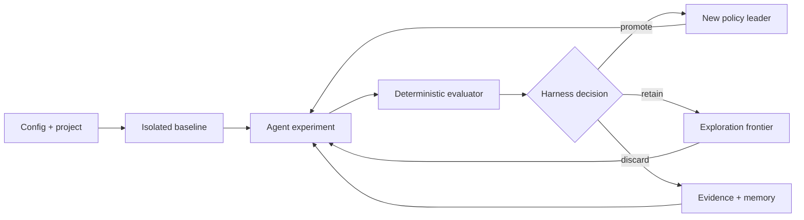

# ML Autoresearch Harness

Kontrolowany framework autonomicznych eksperymentów machine learning zbudowany
na [Pi SDK](https://pi.dev/docs/latest/sdk) i inspirowany
[karpathy/autoresearch](https://github.com/karpathy/autoresearch).

Agent proponuje i implementuje eksperymenty w izolowanych kopiach workspace'u.
Osobny, deterministyczny evaluator mierzy wynik, a harness — nie LLM — stosuje
progi metryk, guardraile i zasady promocji. Każdy run zostawia pełny audit trail,
pamięć badawczą, graf gałęzi, raport oraz lokalny dashboard aktualizowany live.

Projekt jest greenfield. Aktualny schemat i dokumentacja dotyczą przyszłych
runów; stare katalogi `runs/` nie są automatycznie migrowane.

## Możliwości

- izolowany baseline i workspace każdego eksperymentu;
- jawne `mutablePaths`, chroniony evaluator i ukryty holdout;
- modele oraz poziom reasoning konfigurowane per run, rola lub profil;
- strategie exploit, explore, backtrack, replicate, falsify, optimize, ablate,
  merge i ensemble;
- trwałe fakty, notatki LLM, lekcje, pytania i evidence review;
- kampania ticketów z zależnościami i priorytetem gain/probability/information/cost;
- search space, learned acquisition, surrogate search, parameter sweeps i ASHA;
- staged evaluation, early pruning, statystyka adaptacyjna i fresh-seed checks;
- checkpointing, preflight, telemetry faz, shared cache i exact-result cache;
- multi-objective optimization oraz Pareto frontier;
- open research z audytowanym `research_exec`;
- kontrolowany broker zależności Python/Bun i zatwierdzone profile runtime;
- koszt, tokeny, czas, cost/improvement i time/improvement;
- embedded dashboard SvelteKit + SSE + Svelte Flow;
- timestampowany transcript thinking, wiadomości, narzędzi i edycji agenta;
- pause, resume, stop, ręczne enqueue, status i regeneracja raportu;
- pojedyncze executable budowane przez Bun.

## Szybki start

Wymagane są Bun 1.3+ i skonfigurowane uwierzytelnienie providera Pi. Docker jest
zalecanym sandboxem dla open research, a przy controlled dependencies jest
wymagany. Zaufany open research można też jawnie uruchomić lokalnie.

```bash
bun install
bun run typecheck
bun test
bun run build

./dist/ml-autoresearch validate \
  examples/toy-regression/autoresearch.config.json

./dist/ml-autoresearch run \
  examples/toy-regression/autoresearch.config.json \
  --max-experiments 1 \
  --open-ui
```

Dłuższy run bez limitu wall time:

```bash
./dist/ml-autoresearch run autoresearch.config.json \
  --max-experiments 50 \
  --max-wall-time-minutes 0 \
  --model openai-codex/gpt-5.6-sol \
  --thinking-level xhigh
```

`0` dla `--max-wall-time-minutes` oznacza unlimited. Dashboard domyślnie
działa na losowym porcie loopback i po zakończeniu researchu pozostaje dostępny
do `Ctrl+C`. Użyj `--no-ui`, aby proces zakończył się od razu.

## Jak działa run



Każdy eksperyment ma prerejestrowaną hipotezę, rodzica i strategię. Agent może
zmieniać wyłącznie dozwolony obszar. Evaluator zapisuje metryki w ustalonym
kontrakcie. Harness agreguje powtórzenia, sprawdza guardraile i statystykę,
aktualizuje graf oraz utrwala wnioski dla następnych świeżych sesji agenta.

## Przykłady

| Przykład | Pokazuje |
| --- | --- |
| [`examples/toy-regression`](examples/toy-regression) | pełną pętlę, pamięć, staged eval, search i Pareto |
| [`examples/parameter-sweep`](examples/parameter-sweep) | wiele wartości parametru w jednym eksperymencie |
| [`examples/open-research`](examples/open-research) | szeroką autonomię, Docker EDA i zależności runtime |

## Dokumentacja

- [Indeks dokumentacji](docs/README.md)
- [Getting started i instalacja](docs/getting-started.md)
- [Architektura](docs/architecture.md)
- [Pętla researchu i pamięć](docs/research-loop.md)
- [Konfiguracja](docs/configuration.md)
- [Kontrakt evaluatora](docs/evaluator-contract.md)
- [Kontrolowane zależności](docs/runtime-dependencies.md)
- [CLI i lifecycle runu](docs/cli.md)
- [Dashboard](docs/dashboard.md)
- [Przykłady](docs/examples.md)
- [Obecne ograniczenia i bezpieczeństwo](docs/limitations.md)

Formalnym źródłem prawdy konfiguracji jest
[`autoresearch.schema.json`](autoresearch.schema.json). Przed każdym nowym
scenariuszem uruchom `ml-autoresearch validate`.

## Skille dla agentów

Executable zawiera instrukcje, które można przekazać LLM-owi przygotowującemu
scenariusz:

```bash
./dist/ml-autoresearch skill list
./dist/ml-autoresearch skill show ml-autoresearch-design-scenario
./dist/ml-autoresearch skill show all
```

## Development

```bash
bun run dev --help
bun run typecheck
bun test
bun run check
bun run build
```

Frontend znajduje się w `web/`, kod harnessu w `src/`, testy w `test/`, a
embedded skille w `skills/`.
