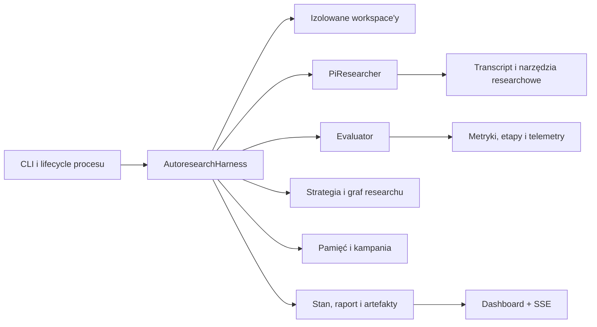

# Architektura harnessu

ML Autoresearch jest lokalnym harnessem do prowadzenia kontrolowanych eksperymentów na kodzie modelu. Agent proponuje i implementuje zmianę, natomiast harness pozostaje właścicielem izolacji, uruchomienia evaluatora, interpretacji metryk, decyzji o promocji oraz trwałego stanu runu. Dzięki temu swoboda badawcza agenta nie oznacza swobody zmiany kryteriów oceny.

## Granica odpowiedzialności

| Obszar | Właściciel | Odpowiedzialność |
| --- | --- | --- |
| Hipoteza i implementacja | agent implementujący | Inspekcja projektu, zaproponowanie falsyfikowalnej zmiany i edycja dozwolonych plików. |
| Niezależna kontrola propozycji | opcjonalny agent recenzujący | Odrzucenie zmiany niebezpiecznej, splątanej, duplikującej wcześniejszą pracę lub niefalsyfikowalnej. Recenzent ma narzędzia tylko do odczytu. |
| Izolacja | harness | Kopiowanie checkpointu do osobnego workspace'u, kontrola ścieżek i fingerprintów. |
| Pomiar | evaluator użytkownika uruchamiany przez harness | Zapis skończonych metryk do kontraktowego pliku JSON; opcjonalnie telemetry, checkpointy i metryki przekrojów. |
| Decyzja | harness | Agregacja powtórzeń, guardraile, statystyka, pruning, promocja albo zachowanie/odrzucenie gałęzi. |
| Interpretacja wyniku | agent | Wniosek, notatki, propozycje aktualizacji lekcji i następne hipotezy. Agent nie może nadpisać decyzji harnessu. |
| Stan i audyt | harness | Atomowy zapis stanu, grafu, pamięci, kampanii, kosztów, logów i raportu. |

## Główne komponenty



### CLI i lifecycle procesu

CLI ładuje i waliduje konfigurację, rozwiązuje model oraz poziom reasoning, sprawdza dostępność runnera, uruchamia dashboard i przekazuje sygnały do harnessu. Pierwsze `Ctrl+C` prosi o przerwanie na bezpiecznej granicy eksperymentu, a drugie wymusza zakończenie aktywnych grup subprocessów.

Jeżeli UI jest włączone, po zakończeniu researchu serwer dashboardu pozostaje aktywny do momentu zamknięcia aplikacji przez użytkownika. Flaga `--no-ui` wyłącza tę warstwę.

### `AutoresearchHarness`

`AutoresearchHarness` jest orkiestratorem runu. Tworzy baseline, wybiera zadanie badawcze, przygotowuje workspace kandydata, uruchamia agenta lub automatyczny wariant eksperymentu, wywołuje evaluator, podejmuje decyzję i zapisuje wynik. Po każdej zakończonej próbie aktualizuje także graf, pamięć, kampanię, meta-politykę i raport.

### Workspace i kontrola zmian

Każdy checkpoint jest pełnym, osobnym katalogiem roboczym. Kopiowanie automatycznie pomija co najmniej `.git`, `node_modules`, `.venv` i `__pycache__`, reguły `copyIgnore`, katalog wynikowy runu oraz skonfigurowane cache. Jeżeli katalog runu znajduje się wewnątrz źródła projektu, kopiowanie odbywa się przez tymczasowy staging poza źródłem, co zapobiega kopiowaniu katalogu do jego własnego podkatalogu.

Harness wykonuje snapshot zawartości i wylicza SHA-256 całego workspace'u. Po pracy agenta porównuje snapshoty, aby ustalić `changedPaths`, odrzucić zmiany poza `mutablePaths` lub wewnątrz `protectedPaths`, wykryć duplikat istniejącego checkpointu i zablokować mutację workspace'u przez evaluator lub fazę refleksji. Ścieżki dostępne narzędziom agenta nie mogą uciekać poza workspace ani prowadzić przez symlinki.

`hiddenPaths` ogranicza to, co agent może zobaczyć, natomiast `protectedPaths` ogranicza to, co może zmienić. Są to różne granice bezpieczeństwa.

### Agent i transcript

Neutralny interfejs `Researcher` może być realizowany przez `PiResearcher` albo izolowany adapter Prime Agent RPC. Implementacja buduje kontekst z bieżącego lidera, wybranego rodzica gałęzi, ostatnich eksperymentów, trwałej pamięci, metod badawczych, kampanii, kryteriów metryk oraz dozwolonych ścieżek. Agent kończy fazę propozycji zarówno narracją Markdown, jak i ustrukturyzowanym planem. Opcjonalny `reviewer` ocenia gotową zmianę, a orkiestracja adaptacyjna dobiera read-only specjalistów przed wydaniem budżetu na evaluator.

Trwały Research Lab jest osobnym, run-scoped środowiskiem Python. Nie jest częścią workspace'u kandydata ani evaluatora. Remote executor deleguje wyłącznie próbę evaluatora przez wersjonowany kontrakt brokera; decyzje metryk i promocji nadal zapadają lokalnie w harnessie.

Znormalizowany `agent-transcript.jsonl` przechowuje ze znacznikami czasu lifecycle, prompty harnessu, thinking, wiadomości, wywołania narzędzi, wyniki i argumenty edycji. Pełny strumień zdarzeń SDK jest osobno zapisywany w `pi-events.jsonl`.

### Evaluator

Evaluator jest dowolną komendą użytkownika uruchamianą lokalnie albo w Dockerze. Harness przekazuje mu m.in. ścieżkę docelowego pliku metryk, seed, identyfikator eksperymentu, nazwę etapu i udział budżetu. W Dockerze workspace jest systemowo montowany tylko do odczytu, a artefakty ewaluacji mają osobny zapisywalny mount. W trybie local evaluator pracuje bezpośrednio w kopii workspace'u z uprawnieniami użytkownika; harness wykrywa niedozwolone mutacje przez porównanie snapshotów, ale system plików sam ich nie blokuje.

Warstwa ewaluacji obsługuje:

- wiele powtórzeń i kontrolowaną współbieżność seedów;
- wieloetapowy budżet oraz wczesne odcinanie wyraźnie słabszych kandydatów;
- adaptacyjne dokładanie seedów, gdy porównanie statystyczne jest niejednoznaczne;
- opcjonalny preflight przed właściwym pomiarem;
- telemetry faz evaluatora w JSONL;
- manifesty checkpointów pomiędzy etapami;
- współdzielony cache i opcjonalny cache dokładnych wyników;
- porównania paired na świeżych seedach;
- kontrolowany sweep jednej zadeklarowanej osi parametru;
- identyczne, zablokowane środowisko paczek dla kandydata, jeżeli włączono broker zależności.

Evaluator musi zapisać skończone wartości liczbowe wszystkich wymaganych metryk. Brak metryki lub wartość niefinitywna powoduje błąd eksperymentu.

### Strategia, graf i frontier

`ResearchGraph` przechowuje baseline i checkpointy eksperymentów wraz z rodzicem, strategią, kategorią zmiany, głębokością gałęzi, metrykami i fingerprintem workspace'u. Graf rozróżnia:

- **leader** — checkpoint akceptowany przez politykę promocji; jego workspace staje się bieżącym `acceptedWorkspacePath`;
- **frontier** — zachowane alternatywy, z których można później eksplorować lub do których można się cofnąć;
- **Pareto frontier** — checkpointy niezdominowane po skonfigurowanych celach;
- **best-observed** — najlepszy surowy wynik primary metric, nawet jeśli checkpoint nie został liderem z powodu guardraila albo polityki dowodowej;
- **retired/discarded/failed** — odpowiednio checkpoint poza aktywnym frontierem, odrzucony kandydat i próba zakończona błędem.

Frontier uwzględnia limit głębokości, tolerowaną tymczasową regresję, `beamWidth` i różnorodność kategorii zmian. Gdy włączono Pareto, kwalifikujące się checkpointy Pareto mogą rozszerzyć podstawowy beam.

### Pamięć, kampania i meta-research

Pamięć ma dwie równoległe warstwy. Harness zapisuje deterministyczne fakty wynikające z pomiaru i decyzji, a agent zapisuje interpretacyjne notatki, proponuje lekcje i kolejne pytania. Aktualizacje dowodów dla lekcji przechodzą deterministyczną kontrolę prerejestracji i rodzaju dowodu; szczegóły opisuje [Pętla researchu](research-loop.md).

Kampania jest trwałą kolejką ticketów typu `hypothesis`, `search`, `ablation`, `merge`, `ensemble` i `slice`. Tickety mają zależności, koszt, oczekiwany zysk, prawdopodobieństwo powodzenia, wartość informacyjną i priorytet. Kolejka może być uzupełniana przez agenta, harness oraz komendy człowieka. Opcjonalny learned acquisition koryguje priorytety na podstawie wykonanych eksperymentów.

Meta-research zapisuje wyniki profili agentów i strategii oraz, gdy jest włączony, okresowo równoważy udziały strategii na podstawie zaobserwowanych nagród. Nie zmienia definicji metryk ani guardraili.

## Trwały model danych

Najważniejszym źródłem prawdy jest `state.json` (`RunState`, obecnie schema version 6). Pozostałe pliki są wyspecjalizowanymi widokami lub szczegółowymi artefaktami:

```text
<run>/
├── config.resolved.json
├── state.json
├── events.jsonl
├── REPORT.md
├── accepted.json
├── best-observed.json
├── frontier.json
├── pareto.json
├── campaign.json
├── research-memory.json
├── RESEARCH_MEMORY.md
├── meta-research.json
├── control.json
├── commands.jsonl
├── baseline/
│   ├── workspace/
│   └── evaluation/
└── experiments/exp-NNNN/
    ├── workspace/
    ├── proposal.md
    ├── proposal.json
    ├── proposal-review.json
    ├── conclusion.md
    ├── conclusion.json
    ├── accounting.json
    ├── agent-transcript.jsonl
    ├── pi-events.jsonl
    ├── analysis/
    ├── evaluation/
    ├── paired-evaluation/
    └── parameter-sweep/
```

Nie każdy opcjonalny plik powstaje w każdym eksperymencie. Przykładowo `paired-evaluation/` istnieje tylko po żądaniu kontrolowanego porównania, a `proposal-review.json` tylko przy skonfigurowanym recenzencie.

Zapisy stanu JSON są atomowe: harness najpierw zapisuje plik tymczasowy, a następnie wykonuje rename. `events.jsonl` jest dopisywanym dziennikiem zdarzeń.

## Dashboard

Dashboard jest statycznym frontendem osadzonym w executable i serwowanym przez `Bun.serve` na `127.0.0.1` oraz losowym porcie, jeżeli nie podano konkretnego. Backend udostępnia snapshot runu, szczegóły eksperymentu i transcript oraz dwa strumienie SSE: globalne zdarzenia runu i zdarzenia transcriptu eksperymentu.

Serwer śledzi `state.json`, `events.jsonl` i transcript na dysku, dzięki czemu działa także w trybie oglądania istniejącego runu. Dashboard jest warstwą obserwacyjną: nie podejmuje decyzji badawczych. Komendy sterujące runem są przekazywane przez osobne artefakty kontroli i aplikowane przez harness na bezpiecznej granicy.

## Wznowienie i odzyskiwanie

`resume` ładuje `config.resolved.json` oraz `state.json`; nie uruchamia ponownie baseline'u. Obsługiwane są tylko runy o aktualnej wersji schematu, z poprawnym baseline'em, które nie mają statusu `completed` ani `stopped`.

Podczas wznowienia harness:

1. przywraca istniejący graf, pamięć, kampanię, metryki i historię;
2. zwraca niedokończone tickety ze stanu `running` do `queued`;
3. rozlicza aktywny czas do ostatniego heartbeat, zamiast doliczać całą przerwę procesu;
4. zaczyna numerację od następnego eksperymentu;
5. przenosi znaleziony katalog niedokończonego `exp-NNNN` do `orphaned/`, zanim utworzy nową próbę o tym ID.

Stan jest więc kontynuowany, ale sesja modelu nie jest wznawiana jako ta sama rozmowa. Nowy agent otrzymuje odtworzony, ograniczony kontekst: trwałą pamięć, kampanię, graf i ostatnie eksperymenty.
