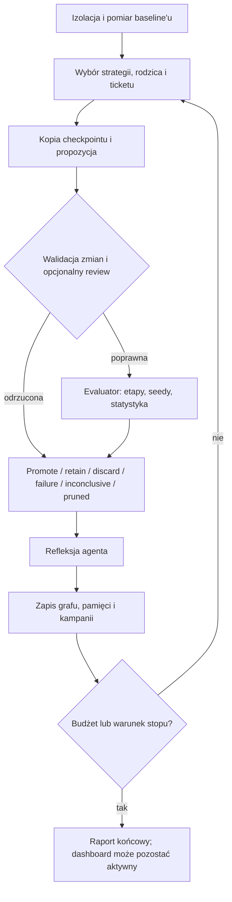
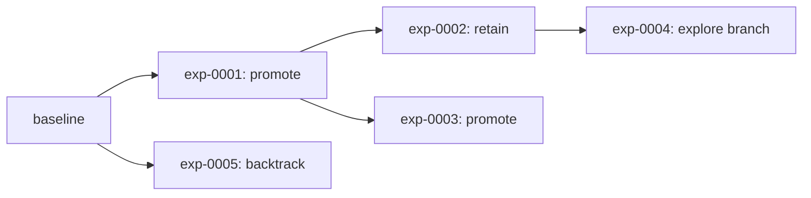

# Pętla researchu

Pętla researchu łączy swobodę agenta z deterministyczną kontrolą eksperymentu. Agent może wybierać kierunek i implementację, ale baseline, evaluator, kryteria metryk oraz decyzja o promocji pozostają poza jego kontrolą.

## Przebieg runu

## 1. Baseline

Nowy run zaczyna się od skopiowania `project.sourceDir` do `baseline/workspace`. Harness wykonuje snapshot, zapisuje fingerprint i uruchamia evaluator. Jeżeli baseline nie zwróci poprawnego zestawu metryk, run kończy się błędem i nie można go wznowić.

Poprawny baseline staje się jednocześnie:

- pierwszym liderem grafu;
- zaakceptowanym workspace'em i zestawem metryk;
- początkowym `best-observed`;
- pierwszym deterministycznym faktem w pamięci;
- punktem odniesienia dla raportu oraz wizualizacji.

Przy `resume` ten krok jest pomijany.

## 2. Wybór następnego zadania

Harness wywołuje `chooseResearchAssignment`. Wynikiem jest strategia, rodzic, głębokość gałęzi, powód wyboru oraz opcjonalny ticket, pytanie lub lekcja do sprawdzenia.

### Strategie

| Strategia | Zachowanie |
| --- | --- |
| `exploit` | Rozwija bieżącego globalnego lidera. Pierwszy eksperyment runu zawsze używa tej strategii. |
| `explore` | Otwiera alternatywę z lidera albo rozwija najmniej używany checkpoint z aktywnego frontieru. |
| `backtrack` | Wraca do wcześniejszego lidera lub checkpointu frontier i próbuje innego kierunku. Gdy brak celu, przechodzi w `explore`. |
| `replicate` | Ponownie mierzy niezmieniony workspace lidera. Jakakolwiek edycja jest błędem, a topologia grafu nie dostaje nowego checkpointu dla identycznej repliki. |
| `falsify` | Próbuje obalić wspieraną lub zatwierdzoną przez człowieka lekcję. Gdy brak takiej lekcji, przechodzi w `explore`. |
| `optimize` | Uruchamia deterministyczną sugestię w zadeklarowanej przestrzeni parametrów. Bez aktywnego search space udział tej strategii jest zerowany. |
| `ablate` | Realizuje przygotowany ticket ablacji promowanego checkpointu. |
| `merge` | Łączy rozłączne zmiany z dwóch przygotowanych checkpointów frontier. |
| `ensemble` | Materializuje kontrolowane, tylko-do-odczytu snapshoty kilku checkpointów jako źródła dla kandydata. |

Udziały strategii są realizowane przez deterministyczne nadrabianie skonfigurowanych proporcji, a nie losowanie przy każdym kroku. Jeśli meta-research jest włączony, może okresowo zmienić te proporcje na podstawie historycznej nagrody.

### Ticket kampanii

Jeżeli kampania jest włączona i jej docelowy udział nie został wykorzystany, assignment może przejąć gotowy ticket o najwyższym priorytecie. Ticket jest gotowy dopiero po ukończeniu wszystkich zależności; brakująca, anulowana lub zablokowana zależność blokuje ticket.

Priorytet bazowy jest funkcją oczekiwanego zysku, szansy powodzenia, wartości informacyjnej i kosztu. Opcjonalny learned acquisition miesza ten deklarowany priorytet z przewidywanym czasem i poprawą wyuczonymi na dotychczasowych eksperymentach. Deduplikacja ticketów korzysta ze znormalizowanej treści hipotezy i rodzaju ticketu.

Kampania nie jest osobnym agentem planującym całość z góry. Jest trwałą kolejką zadań tworzoną przyrostowo przez wyniki runu, propozycje agenta, reguły harnessu i komendy człowieka.

## 3. Przygotowanie kandydata

Harness kopiuje workspace wybranego rodzica do `experiments/exp-NNNN/workspace`, wykonuje snapshot i uruchamia jedną z dwóch ścieżek:

1. **Ścieżka agentowa** — implementer inspektuje projekt, modyfikuje tylko dozwolone ścieżki i zwraca ustrukturyzowany plan eksperymentu.
2. **Ścieżka automatyczna** — ticket `search`, `ablation` lub `merge` może zostać zmaterializowany deterministycznie przez harness. Ensemble przygotowuje źródłowe checkpointy, ale agent nadal buduje ich wykorzystanie.

Plan zawiera hipotezę, kategorię zmiany, oczekiwany efekt, kryterium falsyfikacji, koszt i wartość informacyjną, zasoby, użyte/testowane lekcje, adresowane pytania, następne hipotezy oraz opcjonalne żądanie paired evaluation albo parameter sweep.

Jeżeli skonfigurowano recenzenta, po implementacji ogląda on plan oraz diff i może zablokować wydanie budżetu na evaluator.

## 4. Kontrole przed pomiarem

Przed ewaluacją harness sprawdza:

- czy reviewer zatwierdził propozycję;
- czy opcjonalne żądanie evaluacji mieści się w polityce;
- czy agent nie zmienił ścieżek zabronionych;
- czy replika pozostawiła workspace bez zmian;
- czy zwykły eksperyment rzeczywiście zmienił dozwolony plik (wyjątkiem jest kontrolowane żądanie evaluacji);
- czy fingerprint workspace'u nie był już ewaluowany;
- czy znormalizowana hipoteza nie powtarza wcześniejszej próby.

Duplikat workspace'u albo hipotezy może zostać pominięty bez kosztu evaluatora. Wyjątkiem jest świadome porównanie paired: wynik kanoniczny identycznego checkpointu może zostać ponownie użyty, ale świeże seedy nadal są mierzone.

## 5. Ewaluacja

### Pomiar kanoniczny

Evaluator pracuje na workspace kandydata i porównuje go z aktualnym globalnym liderem. To ważne: kandydat może zostać utworzony ze starszego checkpointu podczas `backtrack` albo z alternatywnej gałęzi, ale jego `primaryDelta` oraz możliwość promocji są oceniane względem lidera obowiązującego przed tym eksperymentem, nie tylko względem rodzica gałęzi.

Każdy etap ma nazwę i `budgetRatio`. Etapy pośrednie mogą przerwać wyraźnie regresującego kandydata. W etapie końcowym harness agreguje powtórzenia zgodnie z konfiguracją metryki. Gdy włączono adaptacyjną statystykę, dokłada seedy do ustalonego maksimum, dopóki dowód jest niejednoznaczny.

Evaluator nie może modyfikować workspace'u. Harness wykonuje snapshot po pomiarze i zamienia taką mutację w `failure`.

### Paired evaluation

Agent może poprosić o porównanie kandydata i lidera na identycznych, świeżych seedach, jeśli pozwala na to konfiguracja. Seedy nie mogą powtarzać seedów kanonicznych i podlegają limitowi. Promocja kandydata, który przeszedł próg kanoniczny, jest blokowana, jeśli świeży paired check nie potwierdzi polityki; wynik może stać się `retain`, `inconclusive` albo `discard`.

### Parameter sweep

Agent może poprosić o przetestowanie wielu wartości dokładnie jednego parametru zadeklarowanego w search space. Harness tworzy osobne workspace'y triali, stosuje wartości, mierzy je tym samym protokołem, może odcinać słabe wartości na wcześniejszych etapach i wybiera jeden zwycięski trial. Całość pozostaje jednym logicznym eksperymentem, a refleksja otrzymuje wyniki wszystkich wartości.

### Równoległa rodzina kandydatów

Gdy `experimentConcurrency > 1`, harness może przygotować rodzinę kandydatów równolegle dla `optimize` lub, po włączeniu odpowiedniej opcji ASHA, dla kandydatów agentowych. W obrębie batcha wszyscy startują z tego samego checkpointu odniesienia; tylko najmocniejszy kandydat spełniający warunki może przejąć promocję, pozostali są rozliczani jako osobne eksperymenty.

## 6. Deterministyczna decyzja

Po pomiarze `decideResearchCandidate` stosuje następującą kolejność:

1. błąd evaluatora daje `failure`;
2. semantic no-op z identycznymi hashami predykcji albo kandydat odcięty na wcześniejszym etapie daje `discard`/`pruned` bez kolejnych stage'y;
3. brak metryk lub złamanie guardraila daje `failure` albo `discard`;
4. statystyczna regresja daje `discard`;
5. niejednoznaczny dowód daje `inconclusive`;
6. poprawa co najmniej `primary.minimumDelta`, potwierdzona przez skonfigurowaną politykę statystyczną, daje `promote`;
7. kandydat Pareto-optymalny może dostać `retain`, mimo że nie przejął primary leadera; dokładny remis całego wektora celów pozostawia starszy checkpoint i nie tworzy nowego punktu Pareto;
8. pozostała alternatywa może dostać `retain`, jeśli mieści się w limicie głębokości i tolerancji tymczasowej regresji;
9. w innym przypadku dostaje `discard`.

Replika nie może promować identycznego checkpointu. Jeżeli paired evaluation dotyczy duplikatu, dowód zostaje dołączony do istniejącego checkpointu bez tworzenia duplikatu w topologii.

## 7. Lider, frontier i branchowanie

Po `promote` stary lider staje się `retired`, kandydat zostaje liderem, a jego `branchDepth` jest zerowany. `accepted.json` oraz `acceptedWorkspacePath` wskazują od tej chwili nowy checkpoint.

Po `retain` lub `inconclusive` kandydat może znaleźć się we frontierze. Frontier zachowuje alternatywne przejścia, dzięki czemu research nie jest wyłącznie zachłannym marszem za bieżącą najlepszą metryką. `explore` rozwija słabiej używane alternatywy, a `backtrack` może wrócić do wcześniejszego lidera lub frontieru.

Graf utrzymuje też osobny Pareto frontier dla wielu celów. `best-observed` nie jest synonimem lidera: wskazuje najlepszy zmierzony primary metric, o ile ewaluacja była poprawna i nie została przycięta, nawet gdy guardrail albo dowód statystyczny zablokował promocję.

## 8. Refleksja i pamięć trwała

Po decyzji agent otrzymuje plan, diff, wynik evaluatora, decyzję harnessu oraz wyniki paired/sweep, jeśli istnieją. Może zapisać interpretację, notatki, aktualizacje pytań, propozycje lekcji i następne hipotezy. Refleksja nie może edytować workspace'u.

### Fakty i notatki

Pamięć celowo zawiera oba rodzaje treści:

- **fakty harnessu** — deterministyczne streszczenie rodzica, strategii, metryk, decyzji, seedów, delty, fingerprintu i ewentualnego paired/sweep;
- **notatki agenta** — obserwacje z propozycji oraz interpretacja po wyniku.

W następnym eksperymencie agent dostaje ograniczone okno: ostatnie fakty i notatki, wszystkie otwarte pytania z ograniczoną historią zamkniętych pytań oraz najwyżej sklasyfikowane lekcje do `maxContextLessons`. Pełna pamięć nadal pozostaje w artefakcie runu.

### Lekcje i kontrola dowodów

Lekcja ma status `tentative`, `supported`, `contradicted`, `retired` albo `human-approved` oraz wskazówki `consider`, `avoid` lub `verify`. Agent proponuje aktualizację, ale harness decyduje, czy może ona zmienić liczniki dowodów.

Najważniejsze reguły:

- nowa lekcja wymaga `relation=new` i bezpośredniego dowodu z eksperymentu, po czym zaczyna jako `tentative`;
- aktualizacja istniejącej lekcji musi używać jej ID;
- test istniejącej lekcji musi być prerejestrowany w planie (`lessonTests`) albo wskazany przez strategię `falsify`;
- zwykła dokładna replika i duplikat nie są niezależnym dowodem;
- fresh-seed paired comparison może być dowodem typu `replication`;
- dowód kontekstowy pozostaje w audycie, ale nie zmienia liczników;
- lekcje `human-approved` są niezmienne;
- progi `supportThreshold` i `contradictionThreshold` determinują zmianę statusu.

Każda przyjęta i odrzucona aktualizacja trafia do `evidenceReviews`, więc użytkownik może sprawdzić nie tylko wniosek agenta, ale także dlaczego harness dopuścił albo odrzucił go jako dowód.

### Pytania badawcze

`nextHypotheses` z refleksji stają się deduplikowanymi, otwartymi pytaniami. Assignment może przypisać otwarte pytanie do kolejnego eksperymentu. Tylko pytanie prerejestrowane jako adresowane może zostać rozwiązane lub unieważnione w refleksji. Pominięty duplikat może unieważnić pytanie z odwołaniem do już istniejącego dowodu, zamiast ponownie wydawać budżet.

### Wiedza pomiędzy runami

Opcjonalna warstwa `knowledge` eksportuje lekcje `supported` i `human-approved`, które spełniają minimalny poziom ufności. Plik ma fingerprint zakresu zależny od nazwy projektu, ścieżki źródła, komendy evaluatora, metryk i własnego `scope`. Niezgodny fingerprint powoduje pominięcie wiedzy.

Lekcja zaimportowana do nowego runu (poza zatwierdzoną przez człowieka) wraca jako `tentative`, dostaje guidance `verify`, maksymalnie 0,75 confidence i puste lokalne liczniki dowodów. Wiedza między runami jest więc wskazówką do ponownej weryfikacji, a nie automatyczną prawdą.

## 9. Rozbudowa kampanii po eksperymencie

Po zapisaniu wyniku harness kończy powiązany ticket i może dodać:

- `followUpHypotheses` z planu;
- `nextHypotheses` z refleksji;
- ablacje po promocji, gdy zmieniło się wiele ścieżek;
- merge dwóch zgodnych, rozłącznych gałęzi frontieru;
- okresowego kandydata ensemble;
- tickety słabych przekrojów z telemetry `sliceMetrics`;
- sugestie search w zadeklarowanej przestrzeni parametrów.

Automatyczna ablacja działa na poziomie całej zmienionej ścieżki: usuwa wskazany plik ze skopiowanego promowanego checkpointu. Należy ją włączać tylko wtedy, gdy `changedPaths` odpowiadają sensownym, niezależnym komponentom. Harness nie potrafi sam wywnioskować semantycznego fragmentu zmiany wewnątrz jednego pliku.

## 10. Zapis, budżet i warunki stopu

Po każdym eksperymencie harness zapisuje rekord, accounting, graf, pamięć, kampanię, Pareto, lidera, `best-observed`, raport i opcjonalną wiedzę projektową. Następna iteracja zaczyna się dopiero po trwałym zapisie tej wiedzy.

Run kończy się po osiągnięciu co najmniej jednego z warunków:

- `maxExperiments`;
- aktywnego czasu `maxWallTimeMinutes` (wartość `0` oznacza brak limitu);
- `maxConsecutiveFailures`;
- żądania stop lub przerwania;
- fatalnego błędu badacza;
- błędu baseline'u.

Pause i stop są sprawdzane na bezpiecznej granicy pomiędzy eksperymentami. Czas pauzy nie zwiększa aktywnego budżetu runu. Po normalnym zakończeniu raport jest kompletny, a dashboard może nadal działać do `Ctrl+C`.
